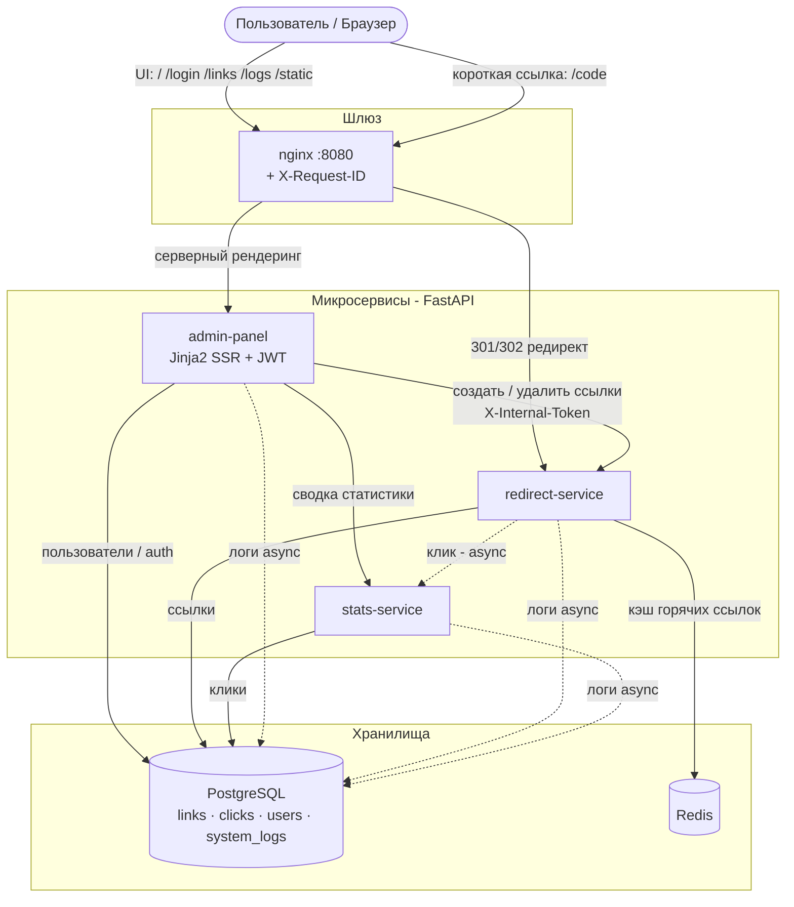

# Архитектура

Система — небольшой **микросервисный** стек за единым шлюзом nginx. Разделение
осознанное: путь редиректа критичен к задержке и активно использует кэш, а
аналитика — это запись событий и более тяжёлые агрегации. Две разные нагрузки —
два сервиса.

## Взаимодействие сервисов

(Исходник: [`diagrams/architecture.mmd`](diagrams/architecture.mmd).)

## Компоненты

| Компонент | Зона ответственности | Стек |
|---|---|---|
| **nginx** | Единая точка входа. Маршрутизирует UI админки и публичные короткие ссылки. Генерирует `X-Request-ID`. | nginx:alpine |
| **admin-panel** | Серверный рендеринг: вход (JWT-cookie), создание ссылок с QR, дашборд, панель здоровья, логи. Владеет таблицей `users`. | FastAPI, Jinja2, Tailwind, htmx, Chart.js |
| **redirect-service** | Генерация коротких кодов, резолв `/{code}` в 302-редирект, кэш горячих ссылок, отправка событий клика. Владеет таблицей `links`. | FastAPI, SQLAlchemy async, Redis |
| **stats-service** | Приём событий клика, разбор user-agent, агрегированная статистика. Владеет таблицей `clicks`. | FastAPI, SQLAlchemy async, user-agents |
| **PostgreSQL** | Надёжное хранение `links`, `clicks`, `users`, `system_logs`. | postgres:16 |
| **Redis** | L1-кэш соответствий `short_code → original_url`. | redis:7 |

## Ключевые потоки

### 1. Создание ссылки
`admin-panel` (форма, после входа) → `POST /api/links` на `redirect-service` с
заголовком `X-Internal-Token` → генерируется уникальный base62-код (с проверкой
коллизий) и сохраняется в `links`. Админка рисует карточку с локальным QR-кодом.

### 2. Резолв короткой ссылки (горячий путь)
`GET /{code}` → `redirect-service` сначала проверяет **Redis**. При промахе
читает `links` из PostgreSQL (с учётом срока жизни) и прогревает кэш с TTL,
ограниченным сроком жизни ссылки. Возвращает **302** (не 301, чтобы каждый клик
учитывался), затем планирует событие клика как **фоновую задачу** — редирект
пользователя никогда не ждёт аналитику.

### 3. Запись аналитики (холодный путь)
Фоновая задача `POST /api/events` → `stats-service` разбирает user-agent в
браузер / ОС / устройство, хэширует IP и вставляет одну строку в `clicks`.
Эндпоинт сразу отвечает **202**.

### 4. Дашборд
`admin-panel` обращается к `stats-service` за `GET /api/stats/summary` — там
выполняются `COUNT` / `GROUP BY` в БД (клики по дням, топ ссылок, разбивка по
устройствам и браузерам); из БД уходят только агрегаты. Графики рисуются на
клиенте через Chart.js и обновляются в реальном времени по `chart.update()`.

### 5. Каскадное удаление
`admin DELETE /links/{code}` → `redirect DELETE /api/links/{code}` (удаляет запись
и чистит кэш Redis) → `stats DELETE /api/clicks/{code}` (удаляет клики кода). Оба
нижестоящих эндпоинта защищены `X-Internal-Token`.

### 6. Сквозная трассировка и логи
nginx присваивает запросу `X-Request-ID`. Middleware каждого сервиса кладёт его в
`contextvar`; логгер добавляет в каждую запись `trace_id`, уровень и имя сервиса.
Идентификатор пробрасывается по внутренним HTTP-вызовам. Все три сервиса
**асинхронно** (через `asyncio.Queue` + фоновая задача) пишут логи в общую
таблицу `system_logs`, которую показывает страница **Logs** в админке.

## Модель данных

- **links** (`redirect-service`): `id, short_code (уник. индекс), original_url, owner_id (индекс), is_private, created_at, expires_at`.
- **clicks** (`stats-service`): `id, short_code (индекс), user_agent, referer, ip_hash, browser, os, device_type, created_at (индекс)`.
- **users** (`admin-panel`): `id, username (уник. индекс), hashed_password, created_at`.
- **system_logs** (общая, инфраструктурная): `id, created_at, service, level, trace_id, logger, message`.

Все три сервиса используют одну базу PostgreSQL. **Межсервисных внешних ключей
нет** — сервисы ссылаются друг на друга только по строке `short_code`, оставаясь
независимо разворачиваемыми. Каждый сервис ведёт свою историю миграций Alembic в
отдельной таблице версий (`alembic_version_{service}`). Таблица `system_logs`
создаётся идемпотентно при старте каждого сервиса (`CREATE TABLE IF NOT EXISTS`).

## Почему так

- **FastAPI** — async (важно для горячего пути редиректа), валидация Pydantic и
  автоматическая OpenAPI-документация на `/docs`.
- **Кэш Redis** — снимает нагрузку с БД на популярных ссылках.
- **Асинхронная отправка кликов и логов** — аналитика и логирование никогда не
  замедляют запрос пользователя.
- **Агрегация на стороне БД** — статистика масштабируется с размером результата,
  а не с объёмом кликов.
- **Без CDN** — htmx, Chart.js и сборка Tailwind лежат локально, поэтому UI
  работает в ограниченных/офлайн-сетях.
